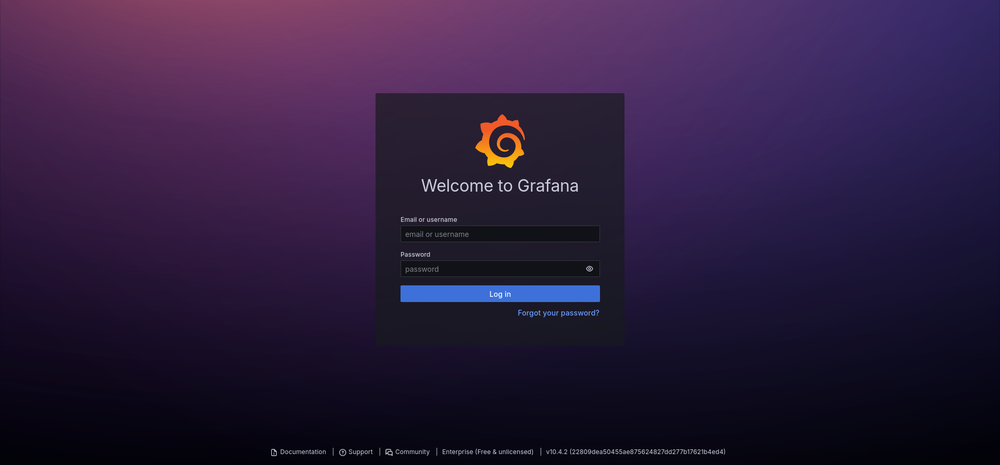
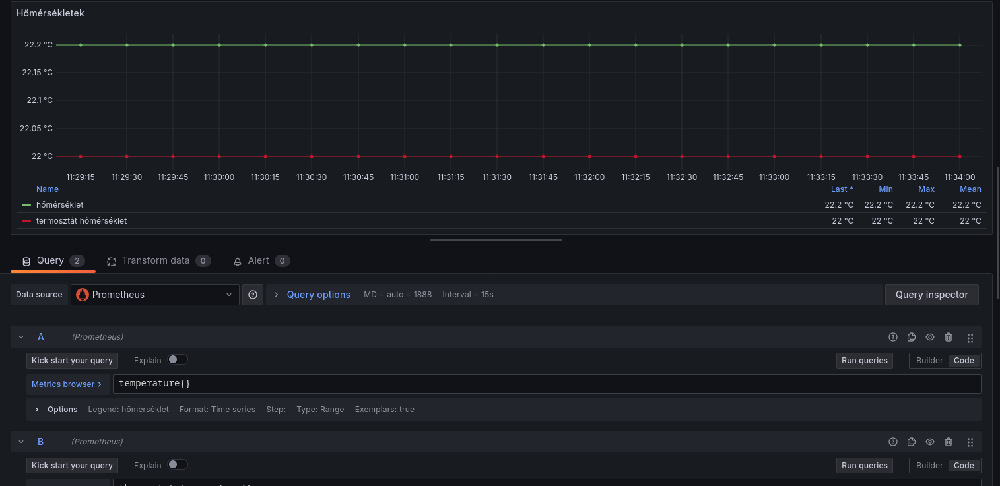
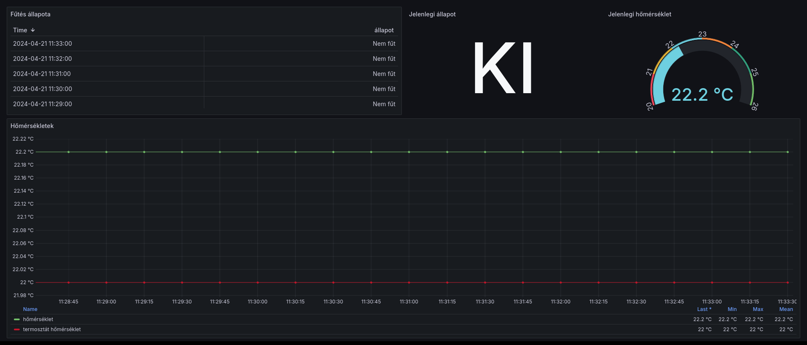

# Féléves feladat - Prometheus

## Általánosságban az adatbázisokról és fajtáikról

Napjainkban a legtöbb üzleti szoftver adatokat tárol és generál, amelyet célszerű optimálisan tárolni. Mivel ez általában nem egy triviális feladat, különböző dedikált adatbázis megoldások születtek a problémákra, amelyek igyekszenek áthidalni ezt a problémát és a fejlesztő számára egy többé kevésbé egyszerű interfészt biztosítani az adatok tárolására és lekérdezésére. A különböző adatbázisok nélkül a folyamatok közötti adatok átadása és tárolása sokkal bonyolultabb lenne.

Az adatbázisokat általában két nagy csoportba szoktuk sorolni: relációs és nem-relációs adatbázisok. A relációs adatbázisok a legelterjedtebbek, és a legtöbb esetben a legjobb választásnak bizonyulnak, ha az adatok közötti kapcsolatokat is fontosnak tartjuk. Ilyen adatbázisra példa a MySQL, PostgreSQL, Oracle, SQL Server, SQLite, stb. A nem-relációs adatbázisokat általában akkor használjuk, ha az adatok közötti kapcsolatok nem fontosak, vagy ha az adatok nagyon nagyok és/vagy gyorsan változnak. Ilyen adatbázisokra példa a MongoDB, Cassandra, Redis, Neo4j, stb.

Beszélhetünk még olyan adatbázis kategorizálási szempontról is, hogy milyen szempontokra optimalizált az adott adatbázis. Például a Redis általában memória alapú kulcs és érték tárolásra alapú adatbázis, amelyet gyors adatelérésekhez használhatunk. A MongoDB dokumentum alapú adatbázis, a Cassandra oszlop alapú adatbázis, a Neo4j pedig gráf alapú adatbázis. Vannak még idő sorrendi adatbázisok, mint például az InfluxDB, vagy a Prometheus, amelyek idősorrendi adatok tárolására és lekérdezésére optimalizáltak. Ezek az adatbázisok általában nagy mennyiségű idősorrendi adatot képesek tárolni és gyorsan lekérdezni.

A továbbiakban a Prometheus idősorrendi adatbázisról lesz szó.

## Prometheus vs. InfluxDB

A Prometheus és az InfluxDB két nagyon hasonló adatbázis, amelyek idősorrendi adatok tárolására és lekérdezésére optimalizáltak. Mindkettőt a Cloud Native Computing Foundation (CNCF) fogadta be, és mindkettőt nagyvállalatok használják a világ minden táján. Az InfluxDB-t általában az IoT (Internet of Things) területen használják, míg a Prometheus-t inkább a monitoring területen. Az InfluxDB-t az InfluxData fejleszti, míg a Prometheus-t az egyik legnagyobb IT cég, a SoundCloud fejleszti.

Bár az adatokat mindkettő technológia hasonló tömörítéssel tárolja, az InfluxDB rustban, míg a Prometheus go-ban íródott. Talán a legelső szembetűnő különbség a lekérdezés nyelvében látszódik. Az InfluxDB-t InfluxQL/Flux nyelven lehet lekérdezni, ami egy SQL-szerű lekérdező nyelv, míg a Prometheus-t PromQL nyelven lehet lekérdezni, ami egy funkcionális lekérdező nyelv. Utóbbinál előny lehet, hogy a programozó valószínűleg fog rendelkezni némi SQL tapasztalattal, így könnyebben tanulhatja meg az InfluxQL-t, mint a PromQL-t. Utóbbi segítségével viszont rövidebb és hatékonyabb lekérdezéseket lehet írni.

Saját tapasztalatok alapján elvileg mindkét megoldás hatékonyan skálázható, a gyakorlat azt mutatta, hogy az InfluxDB jelentős problémákkal küzdött a skálázhatóság terén, míg a Prometheus sokkal stabilabban skálázódott. Elképzelhető, hogy a vállalati verzió ilyen téren jobb képességekkel rendelkezik, de számomra a Prometheus bizonyult a jobb választásnak.

Azt az észrevételemet is fontosnak tartom megjegyezni, hogy az InfluxDB termékcsalád jól összeszedve, egységesen van összerakva, elsőre könnyebb volt használni, mint a Prometheus-t és a kicsit káoszos, különböző emberek által fejlesztett Prometheus komponenseket, mint az exportereket stb.

Ami még érdekes volt elsőre, hogy InfluxDB esetén az adatokat direktben az adatbázisba szokás írni, míg a Prometheus számára bevett gyakorlat, hogy a metrikákat pl. egy HTTP API-n keresztül biztosítjuk, amelyet a Prometheus úgynevezett "scrape" mechanizmusa fog lekérdezni. Ez a megoldás sokkal jobban skálázható, mint az InfluxDB esetén az adatok direktben való írása. Ugyanakkor extra komplexitást is jelent, hiszen az alkalmazásnak tudnia kell, hogy hogyan kell a metrikákat a Prometheus számára elérhetővé tenni, illetve kell biztosítani egy web szervert, amelyen keresztül a Prometheus  össze tudja szedni a neki szükséges metrikákat. A hibakezelés is bonyolultabb, hiszen ha a Prometheus valami oknál fogva nem tudja lekérdezni a metrikákat, akkor az adatok elveszhetnek. A beillesztős megoldás esetén direktben kaphatunk visszajelzést az adatok írásáról, és ha az adatok nem kerültek be az adatbázisba, akkor az alkalmazás tudja jelezni, hogy valami probléma van.

## Prometheus

A Prometheus legfőbb jellemzői, az [online dokumentáció](https://prometheus.io/docs/introduction/overview/) alapján:

- A Prometheus egy open-source monitoring és alerting rendszer, amelyet 2012-ben fejlesztett ki a SoundCloud.
- A Prometheus az idősorrendi adatokat tárolja, és a metrikákat egy HTTP API-n keresztül gyűjti össze.
- A Prometheus a metrikákat egy speciális formátumban tárolja, amelyet a PromQL nyelven lehet lekérdezni.
  - multi-dimenziós adatmodell, idősorrendi adatok tárolására optimalizált, kulcs-érték párok tárolásával
- nem szükséges az adatok tárolására elosztott tároló
- alkalmas service discovery-re, amely lehetővé teszi, hogy a Prometheus automatikusan felfedezze a szolgáltatásokat és azok metrikáit
- jó a Kubernetes támogatása
- metrikák gyűjtése és tárolása mellett lehetőség van alertek definiálására is

## Mire használható / kinek lehet hasznos?

Manapság, főleg az elosztott rendszerek és a mikroszolgáltatások terjedésével egyre nehezebb kumulatív képet kapni az alkalmazások működéséről. Azonban akár egy webszerver, vagy bármilyen hálózati szolgáltatás működését célszerű figyelemmel kísérni. Gyakorlatilag a Prometheusba képesek vagyunk rögzíteni azt, hogy hány aktív kapcsolat érkezett a webszerverünkre, mennyi volt az átlagos válaszidő, hány kérést sikerült kiszolgálni, stb. Ezek az adatok segíthetnek abban, hogy időben észrevegyük a problémákat, és megelőzzük a rendszer összeomlását. Illetve segíthet későbbi analízisekben is, hogy lássuk, milyen időszakokban voltak a legnagyobb terhelések, segíthet üzleti döntésekben, hogy mikor érdemes például új szervereket indítani, stb.

Nagyobb projekteknél elengedhetetlen valamilyen szintű monitoring rendszer bevezetése, és a Prometheus egy nagyon jó választás lehet erre a célra.

## Miért erre esett a választásom?

Rendelkezem egy [Computherm](https://www.computherm.hu/termekek/computherm-rf-szobatermosztatok.html) "okos" termosztáttal, ami gyakorlatilag csak a saját alkalmazásából vezérelhető és a szoftverében elkerülhetetlen, hogy az internetre csatlakoztatva ne küldjön adatokat egy távoli Amazon szerverre. Szerettem volna az adatokat mégis rögzíteni, különféle integrációkat csinálni és okosabban szabályozni a fűtést. Természetesen open-source megoldásokat kerestem, és a Prometheus tűnt a legjobb választásnak korábbi tapasztalataim alapján.

## Megvalósítás

### Előkészületek

Mivel viszonylag kis mennyiségű adatról és azok eléréséről beszélünk, nem gondolkoztam Kubernetes clusterben, erre egyrészt nincs szükség, másrészt túl bonyolult és drága lenne. Tökéletesen megfelel a célra egy önálló szerver. Szerencsére rendelkeztem egy ilyennel, amelyet az [Oracle Cloud](https://www.oracle.com/cloud/free/) ingyenes csomagjából szereztem. Biztosítanak egy 4 vCPU-s, 24 GiB RAM-mal rendelkező, 200 GB-os SSD-vel ellátott ARM64-es szervert, amely tökéletesen megfelel a célra.

A szerverre többek közt Debiant, Ubuntut és Oracle Linuxot engedett telepíteni az Oracle-s kínálat, azonban egyik lehetőségnek sem vagyok nagy kedvelője, így a [Fedora Server](https://getfedora.org/en/server/) mellett döntöttem. Ennek előnye, hogy a RedHat áll mögötte, tehát egy stabil cég támogatja, ugyan nem mindig a legfrissebb verziókat kapjuk, de rolling release a renszer, tehát viszonylag friss verziókat kapunk, illetve gyárilag rendelkezik egy elég jó SELinux konfigurációval, amely a biztonságot növeli. Illetve elérhető AArch64 architektúrára is, amely a szerverem architektúrája. Hátránya, hogy nagyon nehéz volt telepíteni a környezetbe.

Az adatok Oracle szerverre való továbbítását pedig a MikroTik routeremen futó WireGuard VPN segítségével oldottam meg. A WireGuard egy nagyon könnyű, gyors és biztonságos VPN megoldás, amelynek a konfigurálása is egyszerű. Szerencsére egy ideje már a MikroTik is támogatja a WireGuard-ot.

# Telepítés

Szerettem volna a modularítást is szem előtt tartani, így a Prometheus-t Podman segítségével, konténerben telepítettem. A podman egy nagyon jó alternatíva a Dockerre, amelyet a RedHat fejlesztett ki, és a konténerek kezelésére szolgál. A podman a Dockerrel ellentétben nem igényel daemon-t, tehát nem kell root jogosultság a futtatásához, és a konténerek is ugyanúgy futnak, mint a Docker esetén. Gyakorlatilag drop-in replacement a Dockerre, csak képes teljesen rootless módban futni.

Mivel nem találtam Alpine alapú Prometheus konténert, készítettem egyet, az alábbi Dockerfile segítségével:

```Dockerfile
FROM alpine:latest

RUN apk add --no-cache prometheus

COPY prometheus.yml /etc/prometheus/prometheus.yml

CMD [ "prometheus", "--config.file=/etc/prometheus/prometheus.yml" ]
```

Természetesen a konfigot saját igényeimnek megfelelően szerkesztettem, majd hasonlóan jártam el a Grafanával is:

```Dockerfile
FROM alpine:latest

RUN apk add --no-cache grafana

COPY grafana.ini /etc/grafana/grafana.ini

CMD [ "grafana-server" ]
```

Majd készítettem egy közös podot, hogy ezek tudjanak egymással kommunikálni:

```
podman pod create --name monitoring
```

Készítettem még egy nginx reverse proxy-t is, hogy a Grafana webes felületét elérhetővé tegyem a világhálón. Ehhez az `nginx:alpine` konténert használtam.

Majd a konténereket elindítottam és készítettem hozzájuk systemd-s service fájlokat, hogy a rendszer induláskor automatikusan elinduljanak.

```
podman run -it --pod monitoring --name prometheus --rm -v /mappám/prometheus.yml:/etc/prometheus/prometheus.yml:ro prometheus
podman run -it --pod monitoring --name grafana --rm -v /mappám/grafana.ini:/etc/grafana/grafana.ini:ro grafana
podman run -it --pod monitoring --name nginx --rm -p 443:80 nginx
```

Bekonfiguráltam egy aldomaint, illetve Cloudflare segítségével TLS tanúsítványt is szereztem a webes felülethez.

Ezek után a domainen keresztül elérhetővé vált a Grafana webes felülete:



### Adatok rögzítése

Sajnos a Computherm eszközről nem sokat árul el a gyártó, megkeresésre sem adta ki a protokollról szóló dokumentációt, azonban Wireshark segítségével hamar rájöttem, hogy egy ismertebb protokollról van szó, amit kínai IoT eszközöknél előszeretettel alkalmaznak és szerencsére valaki visszafejtette az authentikációt és a protokoll egy részét, [a python-broadlink](https://github.com/mjg59/python-broadlink) csomagban.

Ez jól működött az authentikációra, viszont a hőmérséklet egy tizedes pontosságú megjelenítését nem támogatta, míg a hivatalos alkalmazás igen. Így erre a következő megoldás született:

```python
payload = device.send_request(bytearray([0x01, 0x03, 0x00, 0x00, 0x00, 0x16]))
b5 = payload[5] & 255 # room_temperature
b6 = payload[18] & 255 # external_temperature
b7 = payload[8] # sensor
i = (payload[4] >> 5) & 1
b8 = payload[4] & 1 # power
i2 = (payload[4] >> 3) & 1 # is_decimal
i3 = ((payload[17] >> 4) & 1) + (((payload[17] >> 5) & 1) * 2) # decimal13
```

Nyersen feldolgozom a teljes választ, majd addig szórakoztam az egyes egységek elemzésével, hogy rájöttem az algoritmusra és leimplementáltam Python alapra.

Majd a Pythonos prometheus_client csomag segítségével elkészítettem egy exporter-t, amely a Prometheus által lekérdezhető formátumban szolgáltatja a hőmérsékletet:

```python
def register_prometheus_gauges():
    """
    Registers prometheus gauges for the following:
    - actual temperature
    - thermostat temperature
    - heating state
    """
    # Actual temperature
    internal_temp = Gauge('temperature', 'Temperature of the measurement device', ["temperature"])
    internal_temp.labels('temperature').set_function(lambda: get_temp())
    # External temperature
    external_temp = Gauge('thermostat_temperature', 'Thermostat temperature', ["temperature"])
    external_temp.labels('temperature').set_function(lambda: get_thermostat_temp())
    # Heating state
    heating_state = Gauge('heating_state', 'Heating state', ["state"])
    heating_state.labels('state').set_function(lambda: is_active())
    return internal_temp
```

Lekérdezve a metrikákat, jelen pillanatban ezt a választ kapom:

```
# HELP python_gc_objects_collected_total Objects collected during gc
# TYPE python_gc_objects_collected_total counter
python_gc_objects_collected_total{generation="0"} 381.0
python_gc_objects_collected_total{generation="1"} 0.0
python_gc_objects_collected_total{generation="2"} 0.0
# HELP python_gc_objects_uncollectable_total Uncollectable object found during GC
# TYPE python_gc_objects_uncollectable_total counter
python_gc_objects_uncollectable_total{generation="0"} 0.0
python_gc_objects_uncollectable_total{generation="1"} 0.0
python_gc_objects_uncollectable_total{generation="2"} 0.0
# HELP python_gc_collections_total Number of times this generation was collected
# TYPE python_gc_collections_total counter
python_gc_collections_total{generation="0"} 55.0
python_gc_collections_total{generation="1"} 4.0
python_gc_collections_total{generation="2"} 0.0
# HELP python_info Python platform information
# TYPE python_info gauge
python_info{implementation="CPython",major="3",minor="9",patchlevel="2",version="3.9.2"} 1.0
# HELP process_virtual_memory_bytes Virtual memory size in bytes.
# TYPE process_virtual_memory_bytes gauge
process_virtual_memory_bytes 4.6923776e+07
# HELP process_resident_memory_bytes Resident memory size in bytes.
# TYPE process_resident_memory_bytes gauge
process_resident_memory_bytes 1.8989056e+07
# HELP process_start_time_seconds Start time of the process since unix epoch in seconds.
# TYPE process_start_time_seconds gauge
process_start_time_seconds 1.71369007664e+09
# HELP process_cpu_seconds_total Total user and system CPU time spent in seconds.
# TYPE process_cpu_seconds_total counter
process_cpu_seconds_total 1.38
# HELP process_open_fds Number of open file descriptors.
# TYPE process_open_fds gauge
process_open_fds 6.0
# HELP process_max_fds Maximum number of open file descriptors.
# TYPE process_max_fds gauge
process_max_fds 1024.0
# HELP temperature Temperature of the measurement device
# TYPE temperature gauge
temperature{temperature="temperature"} 22.2
# HELP thermostat_temperature Thermostat temperature
# TYPE thermostat_temperature gauge
thermostat_temperature{temperature="temperature"} 22.0
# HELP heating_state Heating state
# TYPE heating_state gauge
heating_state{state="state"} 0.0
```

Jól látható, hogy a hőmérsékletet és a termostát hőmérsékletet is sikerült lekérdezni, illetve a fűtés állapotát is.

Már csak a Prometheusba kell bekötni ezeket az adatokat, amelyhez a következő konfigurációt használtam:

```yaml
scrape_configs:
  # The job name is added as a label `job=<job_name>` to any timeseries scraped from this config.
  - job_name: "prometheus"

    # metrics_path defaults to '/metrics'
    # scheme defaults to 'http'.

    static_configs:
      - targets: ["localhost:9090"]

  - job_name: 'temperatures'
    static_configs:
    - targets: ['192.168.1.7:8000']
```

Ezután a Prometheus már képes volt lekérdezni az adatokat és tárolni azokat.

### Grafana beállítása

A Grafana beállítása is egyszerű volt, a Prometheus-t egyszerűen hozzá lehetett adni adatforrásként, majd elérhetővé vált az összes adatom lekérdezésre.

Először a következő grafikont készítettem el:



Ez egy mezei `temperature{}` és `thermostat_temperature{}` metrikákból készült grafikon, amely jól mutatja a hőmérséklet változását, azok átlagát, stb.

Végül készítettem a `heating_state{}` alapján egy táblázatot a korábbi állapotokról, illetve kiszedtem az aktuális hőmérsékletet egy barátságos Gauge widgetbe és kiírtam külön a jelenlegi fűtési állapotot is:



A teljes rendszer tehát működik, a hőmérsékletet rögzíti, tárolja és megjeleníti a Prometheus és a Grafana.

## Összegzés

A Prometheus egy nagyon jó választás lehet monitoring rendszernek, különösen idősorrendi adatok tárolására és lekérdezésére. A Prometheus és az InfluxDB közötti választás nehéz lehet, mindkettőnek megvannak a maga előnyei és hátrányai, azonban a Prometheus a saját tapasztalataim alapján stabilabban skálázódik, kisebb erőforrásokon is jól működik, és a PromQL nyelv is viszonylag könnyen tanulható.